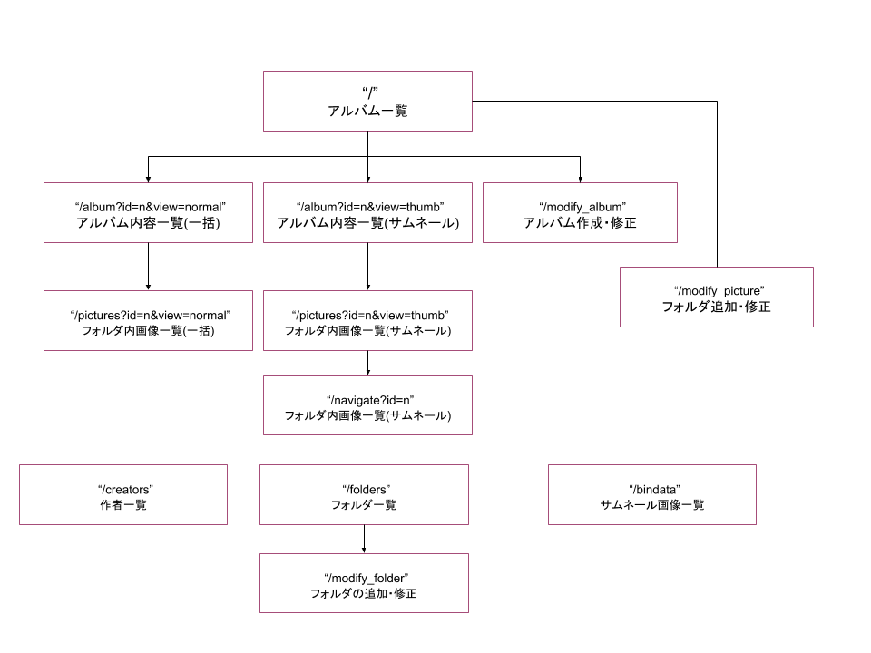

"# express PictureAlbum" 

#  1 アルバム一覧
##   1.1 route
      "/" (デフォルトのページ)
##   1.2 メニュー
      * [アルバムの作成・修正] アルバムを作成・修正・無効化する。[7]
      * [画像の追加・修正] 画像を追加・修正・無効化する。[8]
      * [アルバムグループの選択] 表示するアルバムグループの選択
      * [最初・前へ・次へ・最後] ページ移動
      * [画像フォルダ一覧][4]
      * [画像フォルダの追加・修正][9]
      * [サムネール画像一覧][10]

#  2 アルバム内容一覧(一括表示)
     id=n で指定されたアルバムに含まれる画像一覧 (一括表示)
##   2.1 route
      "/album_normal?id=n"
##   2.2 メニュー
      * [TOP] アルバム一覧へ戻る。
      * [サムネール表示]
      * [画像の追加・修正] 画像を追加・修正・無効化する。（新タブ）
      * [画像の幅をウィンドウに合わせる]

#  3 アルバム内容一覧(サムネール表示)
     id=n で指定されたアルバムに含まれる画像一覧 (サムネール表示)
##   3.1 route
       "/album_thumb?id=n"
##   3.2 メニュー
       * [TOP] アルバム一覧へ戻る。
       * [一括表示]
       * [画像の追加・修正] 画像を追加・修正・無効化する。（新タブ）

#  4 画像フォルダに含まれる画像一括表示
   これは上の２または３で画像をクリックしたとき遷移するページである。
##   4.1 route
      "/pictures?id=n&view=normal"
##   4.2 メニュー
      * [TOP] アルバム一覧へ戻る。
      * [サムネール表示に切り替える]
      * [表示画像の幅をウィンドウに合わせる]
      * [最初・前へ・次へ・最後]  ページ切り替え
      * [逆順で表示]
      * [ワード条件]
      * [id 指定]

#  5  画像フォルダに含まれる画像サムネール表示
   これは上の 4.2.2 のメニューをクリックしたとき遷移するページである。
##   5.1 route
       "/pictures?id=n&view=thumb"
##   5.2 メニュー
      * [TOP] アルバム一覧へ戻る。
      * [一括表示に切り替える]

#  6  サムネールをクリックしたときのノーマル画像とナビゲーション
   これは上の５で画像をクリックしたとき遷移するページである。
##   6.1 route
       "/navigate?id=n"
##   6.2 メニュー
      * [TOP] アルバム一覧へ戻る。
      * [サムネール一覧表へ戻る]
      * [画像の幅をウィンドウに合わせる]
      * [最初・前へ・次へ・最後] ページ切り替え

#  7  アルバムの作成・修正
   これは上の1.2.1メニューをクリックしたとき遷移するページある。
##   7.1 route
        "/modify_album"
##   7.2 メニュー
       * [TOP] アルバム一覧へ戻る。

#  8  画像の追加・修正
   これは PictureAlbum テーブルの操作を行うフォームである。
##   8.1 route
       "/modify_picture"
##   8.2 メニュー
       * [TOP] アルバム一覧へ戻る。

#  9 画像フォルダの追加・修正
   これは Pictures テーブルの操作を行うフォームである。
##   9.1 route
       "/modify_folders"
##   9.2 メニュー
      [TOP] アルバム一覧へ戻る。

#  10 サムネール画像一覧
   これは BINDATA テーブルの内容一覧を表示する。
##   10.1 route
        "/bindata"
##   10.2 メニュー
       * [TOP] アルバム一覧へ戻る。

#  11 作者一覧
   これは Pictures テーブルから creator フィールドを重複なしで取得して表示する。
##   11.1 route
        "/creators"
##   11.2 メニュー
       * [TOP] アルバム一覧へ戻る。

